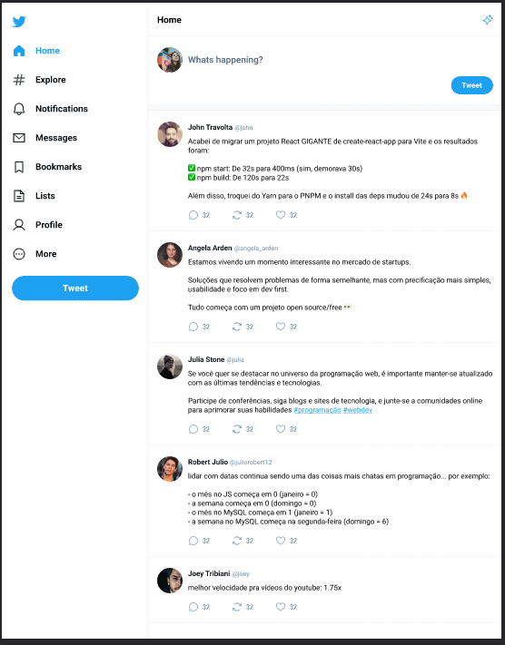

# Twitter UI Clone



## Overview

This project is a clone of the Twitter user interface, developed using React, Vite, TypeScript, HTML, CSS, and managed with Git. It is designed for educational and learning purposes, showcasing how to build a Twitter-like interface using modern web technologies. It's a great way to learn how to work with Vite, TypeScript, and enhance your user interface design skills.

## Technologies Used

- [React](https://reactjs.org/): A JavaScript library for building user interfaces.
- [Vite](https://vitejs.dev/): A fast and lightweight web app builder that uses native ES modules.
- [TypeScript](https://www.typescriptlang.org/): A statically typed programming language that builds on JavaScript.
- HTML: Markup language for structuring web content.
- CSS: Styling language for UI design.

## Getting Started

### Prerequisites

- Node.js and npm installed on your machine.

### Installation

1. **Clone the Repository**
   ```bash
   git clone https://github.com/your-username/twitter-ui-clone.git

2.**Navigate to the Project Directory**
```bash
  cd twitter-ui-clone
```

3.**Install Dependencies**
```bash
  npm install
```

4.**Usage**
  *Run the Project*
```bash
  npm run dev
```

Open your browser and access http://localhost:3000.

###Contributing
Feel free to contribute to this project. You can open issues or send pull requests for improvements or bug fixes. Please make sure to follow the project's contribution guidelines.

###License
This project is licensed under the MIT License - see the LICENSE file for details.

